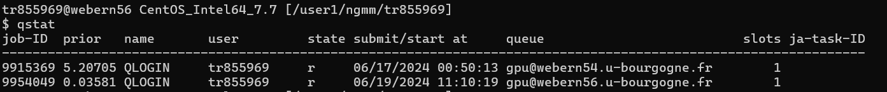

# Using GPU on CCUB Server

This guide provides detailed steps for using `qlogin` and `qsub` commands on the CCUB server for job management with Sun Grid Engine (SGE).

## Steps

### 1. Using qlogin for Interactive Jobs

The `qlogin` command allows you to start an interactive session on a compute node.

1. **Open a Terminal**
   - Connect to the CCUB server and open a terminal.

2. **Start an Interactive Session**
   - Use the following command to start an interactive session:
     ```sh
     qlogin -q gpu
     ```
   - This command requests an interactive session on the "gpu" queue.

3. **End the Session**
   - To end the interactive session, simply type `exit` or close the terminal window.

### 2. Using qsub for Batch Jobs

The `qsub` command is used to submit batch jobs to the queue.

1. **Prepare a Job Script**
   - Create a job script with the necessary commands to execute your task. For example `my_job.ksh` [Details](06.Job_script.md) 
     ```sh
     #!/bin/bash
     #$ -N my_job_name
     #$ -q batch
     #$ -o output_file.log
     #$ -e error_file.log
     #$ -cwd
     python myscript.py
     ```

2. **Submit the Job**
   - Submit the job script using `qsub`:
     ```sh
     qsub -q gpu my_job.ksh
     ```
   - This command submits the job to the "batch" queue.

3. **Check Job Status**
   - To check the status of your job, use the `qstat` command:
     ```sh
     qstat
     ```
   - This will display the list of currently running jobs and their status.
   
   

4. **Delete a Job**
   - If you need to delete a job, use the `qdel` command followed by the job ID:
     ```sh
     qdel <job_id>
     ```
     like:
     ```sh
     qdel 9915369
     ```

## Additional Resources

- [Sun Grid Engine Documentation](https://www.oracle.com/technical-resources/articles/it-infrastructure/sge-part1.html)
- [CCUB Official Page](https://ccub.u-bourgogne.fr/dnum-ccub/spip.php?article379)

## Contact

For further assistance, contact the CCUB support team at [ccub@u-bourgogne.fr](mailto:ccub@u-bourgogne.fr).

---

This document provides a step-by-step guide for using `qlogin` and `qsub` on the CCUB server. Follow the instructions carefully to manage your jobs effectively.
