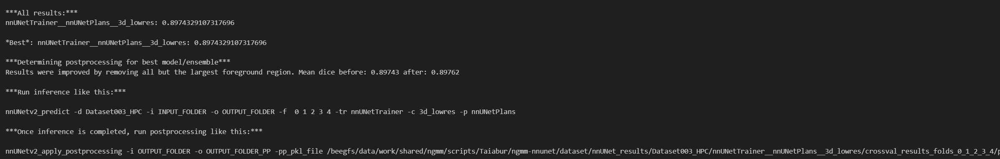

# nnU-Net Training prediction, and Post-processing Documentation

This documentation describes the procedures and commands executed in `02.datathon.ipynb`, `02.nnUnetv2_001.ipynb`, and `02.roi24.ipynb` for training nnU-Net models. These notebooks utilize similar commands across different platforms, including Jupyter Notebooks and interactive modes in cloud computing environments.
## Overview
The `02.datathon.ipynb` notebook is tailored for a datathon scenario where 3D low-resolution nnU-Net models are trained over 5 cross-validation folds. The notebook also guides through determining the best model configurations and outlines steps for inference and post-processing.

## Training Process
Training is conducted separately for each of the five folds using the nnU-Net framework. Here are the commands used for each fold:

- **Training Fold 0**:
  ```bash
  !nnUNetv2_train 3 3d_lowres 0 --npz
  ```
- **Training Fold 1**:
  ```bash
  !nnUNetv2_train 3 3d_lowres 1 --npz
  ```
- **Training Fold 2**:
  ```bash
  !nnUNetv2_train 3 3d_lowres 2 --npz
  ```
- **Training Fold 3**:
  ```bash
  !nnUNetv2_train 3 3d_lowres 3 --npz
  ```
- **Training Fold 4**:
  ```bash
  !nnUNetv2_train 3 3d_lowres 4 --npz
  ```


## Command Overview

This command is designed to launch the training process of a neural network specifically tuned for biomedical image segmentation. Below, we breakdown the components of this command to clarify its functionality.

## Command Breakdown

- **`nnUNetv2_train`**: This is the executable command that starts the training process of the nnU-Net, a neural network architecture designed for medical image segmentation.

- **`3`**: Represents the task identifier or number. In the context of nnU-Net, different numbers are assigned to various segmentation challenges, each with its unique dataset and segmentation goals.

- **`3d_lowres`**: Specifies the configuration setting for the training. The term `3d_lowres` stands for 3D low resolution, which indicates that the model will be trained using three-dimensional data at a reduced resolution. This setting is often chosen to decrease training times and computational demands without significantly impacting the performance for certain applications.

- **`0`**: Indicates the fold number in a cross-validation setup. Here, `0` represents the first fold. Using cross-validation, the model's generalization capabilities can be assessed more robustly as it trains and validates across different subsets of the data.

- **`--npz`**: This flag instructs the training process to save the softmax probabilities of the model’s predictions in NPZ (NumPy compressed) file format. Storing probabilities is crucial for analyzing the model's confidence in its predictions and can be utilized for further optimizations like post-processing or generating uncertainty maps.


## Finding the Best Configuration
After training, the best configuration is identified using:
```bash
!nnUNetv2_find_best_configuration 3 -c 3d_lowres
```
The output of this command indicates the performance of the best model and advises on post-processing improvements.




## Common Command Usage

In each of these notebooks, nnU-Net training and preprocessing commands are used extensively. Here is a general command to check dataset compatibility and integrity before training:

```bash
!nnUNetv2_plan_and_preprocess -d 1 --verify_dataset_integrity
```

This command helps ensure that the dataset is correctly formatted and all necessary files are present before proceeding with the training process.

## Training Configurations

nnU-Net supports several training configurations to optimize performance across various hardware setups and data characteristics. The common configurations used across these notebooks are:

- **2D**: This configuration is ideal for datasets where capturing spatial coherence in the axial plane is more critical than across slices.
- **3D Low Resolution (3d_lowres)**: Suitable for quick training cycles or when computational resources are limited. It processes the data at a lower resolution.
- **3D Full Resolution (3d_fullres)**: Utilizes the full resolution of the data for training, ideal for datasets where detail is crucial for accurate segmentation.

## Platform-Specific Integration

The notebooks also integrate with cloud computing environments, such as CCUB, where specific GPU resources can be accessed. Documentation for accessing these resources is available in:

[Access GPU Resources](05.Access_GPU.md)

This guide details the steps required to utilize GPU resources effectively for nnU-Net training sessions in cloud environments.

## Inference
Inference is performed using the best model across all trained folds:
```bash
!nnUNetv2_predict -d Dataset003_HPC -i INPUT_FOLDER -o OUTPUT_FOLDER -f  0 1 2 3 4 -tr nnUNetTrainer -c 3d_lowres -p nnUNetPlans
```

## Post-processing
Following inference, post-processing is applied to enhance the results further:
```bash
!nnUNetv2_apply_postprocessing -i OUTPUT_FOLDER -o OUTPUT_FOLDER_PP -pp_pkl_file /path/to/postprocessing.pkl -np 8 -plans_json /path/to/plans.json
```

---
*Documents generated by*  
**Taiabur Rahman**  
[https://taiaburbd.github.io/](https://taiaburbd.github.io/)  
<taiaburbd@gmail.com>

---